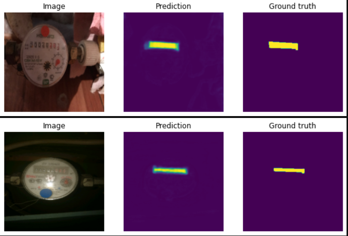
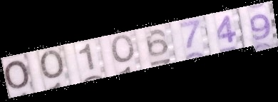
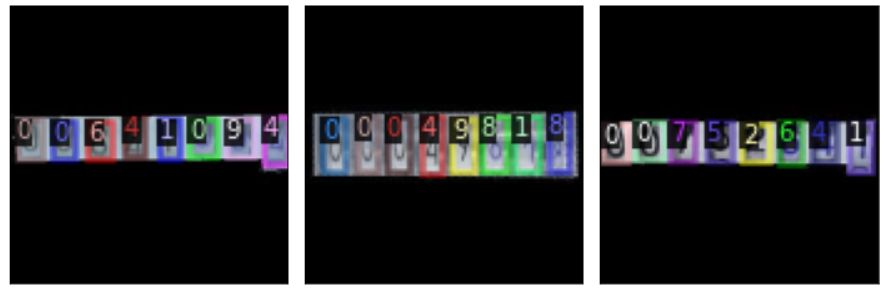
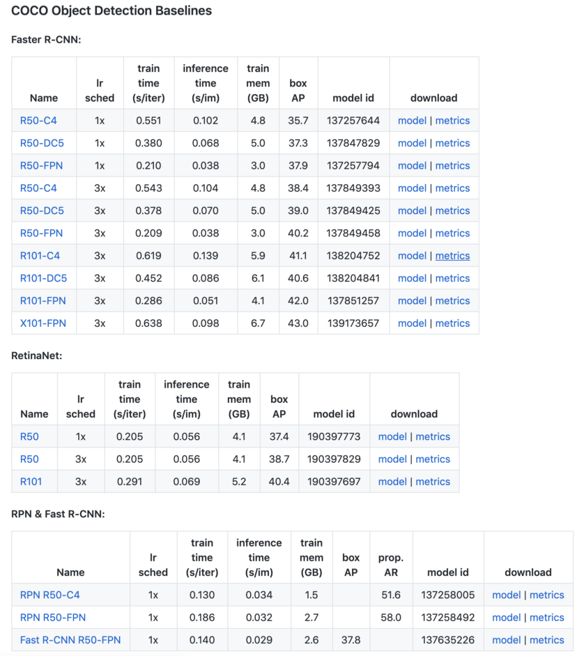

# Intenship-Description-Task-1
As task not contain dataset, i suggest to use kaggle [water meter dataset.](https://www.kaggle.com/datasets/tapakah68/yandextoloka-water-meters-dataset)

P.S. Because of not simple install (and by reason of saving time to check all solutions) of some [packages](https://detectron2.readthedocs.io/en/latest/tutorials/install.html) there is no .py files. Programm can be tested step by step with notebooks. .zip archive conatins requirements.txt, but pipreqs can not detect detectron2 and it's may not work with pip also.

## OCR task consists of 3 steps:
1) Semantic segmentation model to allocate the numbers of the water meter and then crop it.
2) OCR model to predict exact numbers on the cropped image.
3) Combine it together.

Data is not prepared for segmentation due to not same shape and not normalized, also it's useful to check if there is an empty masks or image id is not the same as mask id.
Seg_train.ipynb contains some visualization of the provided data for each step.
After checking we rezize it into shape (256, 256) via opencv and, as usual, we should not forget to use augmentations with [albumentations.](https://github.com/albumentations-team/albumentations)

Now splititing dataset into validation and training parts and we are ready to train our model.

## Results & architecture

### Architecture

 - Architecture: UNet & EfficientNetB0
 - Loss function: FocalLoss (DiceLoss or DiceBCELoss might be better)
 - Metric: Dice coefficient
 - Optimizer: Adam (lr=1e-3, decay=1e-6)
 - learning scheduler: ReduceLROnPlateau(factor=0.5, patience=5)
 
 ## Results:
 | Architecture | dice_coef | Input & Mask Resolution | Epochs | steps per epoch |
| ------ | ------ | ------ | ------ | ------ |
| UNet & EfficientNetB0 | 0.6283 | (256x256)  | 50 | 200 |

## Preparing dataset for OCR model

Before starting cropping dataset, should to say, i will use masks from dataset, not output of the segmentation model because it's better to train ocr model on the best dataset. Naturally i will create a prediction program for an single image using mask from segmentation model.

After using bitwise opencv operation on images with help of the masks, we need to care about rotation of the new cropped image:

After rotating:

Our objective is to input cropped photos into our OCR model utilizing the segmentation model's generated masks and associated images. Then, using the 200-meter sample of manually labeled images, we will train a Faster RCNN model. Our objective is to create a Faster RCNN model that can identify meters' digits with accuracy and forecast their values. We will parse the data and reformat the predictions using the output data from such a model on test photos so that the predictions appear in order from left to right. The digits will then be properly combined to get the final meter reading

Already created and ready for ocr model dataset can be downloaded via link: [**download**](https://app.roboflow.com/ds/jGCiAQzrvI?key=ZmR7CmNT98)

### Examples:

Our photos are split and labeled with the appropriate label for each digit, as shown above. Dataset is divided into training (70%), validation (20%), and testing (10%) datasets, to train a special Detectron2 Faster RCNN model, according to [article](https://towardsdatascience.com/how-to-train-detectron2-on-custom-object-detection-data-be9d1c233e4)

To specify, should to say, we will use  faster_rcnn_X_101_32x8d_FPN, but Detectron2 allows you many options in determining your model architecture, which you can see in the [Detectron2 model zoo](https://github.com/facebookresearch/detectron2/blob/main/MODEL_ZOO.md)

After trainig there is a raw output, here are steps to extract predicitions:
1) Read image and get output information. 
2) Find predicted boxes and labels.
3) Obtain list of all predictions and the leftmost x-coordinate for bounding box.
4) Sort the list based on x-coordinate in order to get proper order or meter reading.
5) Get final order of identified classes, and map them to class value.
6) Add decimal point to list of digits depending on number of bounding boxes.
7) Combine digits and convert them into a float.

## Prediction program

To try yourself this model (UNet&EfficientNetB0 + faster_rcnn_X_101_32x8d_FPN + post proccesing logic) we need create a program that:

Before start to describe steps we need 3 files: water_meter.h5, model_final.pth, Water counter.jpg
1) Resize (256,256)
2) Normalize data (/255.)
3) Load model (Not forget about custom loss and metrics)
4) Each pixel is a probability [0,1] of a mask, we can cluster them: pixelvalue > 0.5
5) Cropping using bitwise operation.
6) Use model_final.pth and repeate steps to extract predicitions

## OCR Results

 Example:

 
 
 Meter reading: 1137.075

Task 1.zip contains notebooks for:

Seg_train.ipynb for training segmentation model (part 1).

Colab_links.txt links for part 2 and 3.

